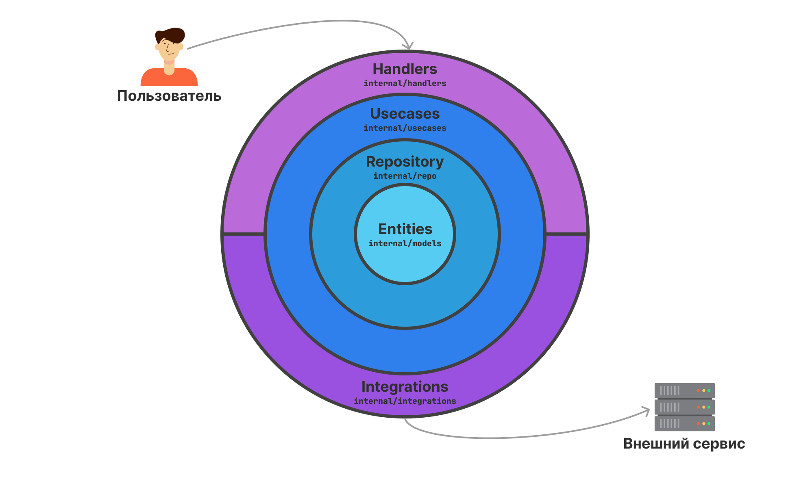
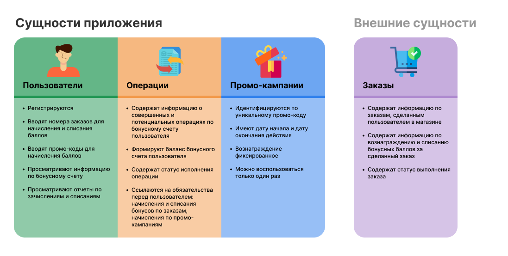
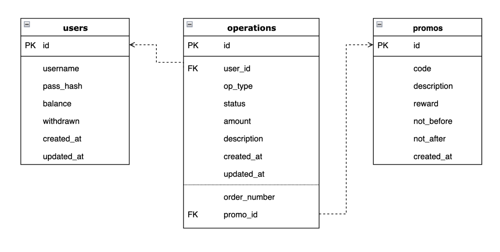
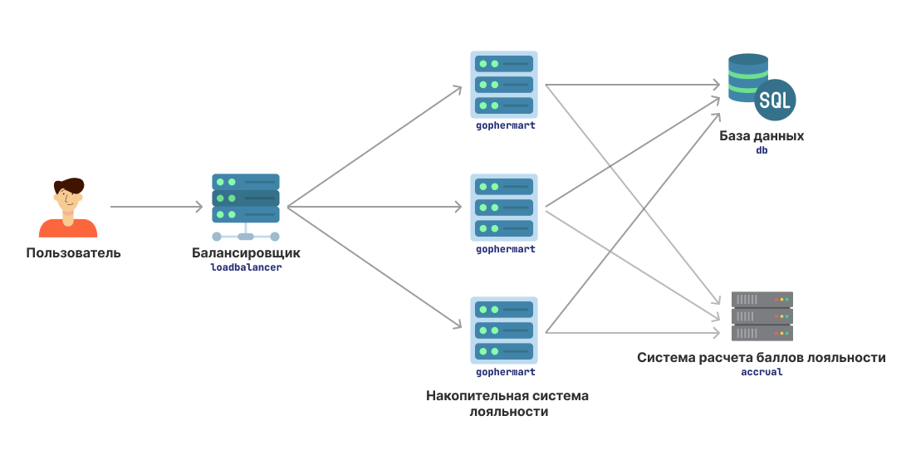

# gophermart — накопительная система лояльности

- [Общая информация](#abstract)
- [Архитектура](#arch)
  - [Организация приложения](#arch-principle)
  - [Бизнес-сущности](#arch-entities)
  - [Схема БД](#arch-db)
- [Особенности реализации](#implement)
  - [Конфигурация приложения](#implement-config)
  - [Работа с базой данных](#implement-db)
  - [Баланс пользователя](#implement-balance)
  - [Обработка ошибок](#implement-errors)
  - [Интеграция с системой начисления бонусов](#implement-accrual)
  - [Использованные библиотеки](#implement-deps)
- [Дополнительная функциональность](#extra)
  - [Зачисления по промо-кодам](#extra-promo)
  - [История операций по накопительному счету](#extra-hist)
  - [Стаб интеграции с магазином](#extra-shop)
  - [Возможность работы в кластере](#extra-cluster)
- [Итоги и обратная связь](#summary)
  - [Освоенные темы](#summary-topics)
  - [Замечания к спецификации](#summary-remarks)
  - [Развитие и возможные альтернативные подходы к реализации](#summary-further)

# Общая информация <a name="abstract"/>

Реализация HTTP API накопительной системы лояльности «Гофермарт»: первый выпускной проект курса  «Продвинутый Golang».

Помимо требований технического задания, в инициативном порядке реализованы следующие дополнительные требования:
- Зачисления по промо-кодам
- История операций по накопительному счету
- Стаб интеграции с магазином
- Возможность работы в кластере

Подробнее см: [Дополнительная функциональность](#extra)


# Архитектура <a name="arch"/>

## Организация приложения <a name="arch-principle"/>


## Бизнес-сущности <a name="arch-entities"/>


## Схема БД <a name="arch-db"/>


Подробнее см [internal/repo/migrations/01_initial.sql](internal/repo/migrations/01_initial.sql)

# Особенности реализации <a name="implement"/>

## Конфигурация приложения <a name="implement-config"/>

Приложение конфигурируется переменными окружения и флагами командной строки.

| Переменная окружения | Флаг командной строки | Описание |
| --- | --- | --- |
| `DATABASE_URI` | `-d <dsn>` | адрес подключения к базе данных |
| `RUN_ADDRESS`| `-a <host:port>` | адрес и порт запуска сервиса |
| `AUTH_SECRET` | _нет_ | ключ для подписи токена |
| `AUTH_TTL` | `-t <duration>` | время жизни авторизационного токена |
| `ACCRUAL_SYSTEM_ADDRESS` | `-r <url>` | адрес системы расчёта начислений |
| `ACCRUAL_SYSTEM_TIMEOUT` | `-m <duration>` | таймаут запросов к системе расчёта начислений |
| `ACCRUAL_SYSTEM_POLL_INTERVAL` | `-p <duration>` | интервал опроса системы расчёта начислений |

## Работа с базой данных <a name="implement-db"/>
Все операции над данными, которые требуют более одного SQL-запроса выполняются в рамках транзакций. Таким образом данными можно безопасно работать из нескольких параллельных горутин или процессов.

Значительная часть валидации бизнес-данных реализована в виде ограничений SQL (SQL Constraints). Это позволяет поддерживать консистентность бизнес-данных на уровне БД. Подробнее см [internal/repo/errors.go](internal/repo/errors.go)

## Баланс пользователя <a name="implement-balance"/>
Баланс пользователя — общая сумма доступных бонусных баллов на счете и кол-во списанных баллов — обновляется каждый раз при создании и обновлении любой операции пользователя.

## Обработка ошибок <a name="implement-errors"/>
При возникновении ошибки сначала логируются детали ошибки. При этом в вышестоящий компонент приложения возвращается не исходная ошибка, а соответствующая ей ошибка приложения `errs.Error`.

```golang
type Error struct {
	error
	Code     int
	HTTPCode int
}
```

Если ошибка произошла в рамках пользовательского HTTP-запроса, то во всех компонентах также логируется `request_id` пользовательского запроса. Это позволяет идентифицировать запрос, который вызвал ошибку, независимо от того, в каком компоненте приложения ошибка произошла.

При этом, пользователю возвращается соответствующий ошибке HTTP-код и детальное описание в ошибки в JSON.

```
HTTP/1.1 409 Conflict
Content-Type: application/json

{
   "code": 1204,
   "message": "Order number belongs to another user",
   "request_id": "<request id>"
}
```


### Общие ошибки приложения (1000-1099)
| Ошибка | Описание | Ограничение БД | Код ошибки | HTTP-код |
| --- | --- | --- | --- | --- |
| **ErrInternal** | внутренняя ошибка сервера | - | 1000 | 500 |
| **ErrNotFound** | не найдено | - | 1001 | 404 |
| **ErrUnauthorized** | пользователь не авторизован | - | 1002 | 401 |
| **ErrBadRequest** | неверный запрос | - | 1003 | 400 |


### Ошибки пользователя (1100-1199)
| Ошибка | Описание | Ограничение БД | Код ошибки | HTTP-код |
| --- | --- | --- | --- | --- |
| **ErrUserAlreadyExists** | логин должен быть уникальным | `username_unique` | 1100 | 409 |
| **ErrUserLoginInvalid** | недопустимый логин | - | 1101 | 400 |
| **ErrUserPassInvalid** | недопустимый пароль | - | 1102 | 400 |
| **ErrUserLoginPassMismatch** | неверная пара логин/пароль | – | 1103 | 401 |
| **ErrUserBalanceNegative** | общая сумма на счете не может быть отрицательной | `balance_not_negative` | 1105 | 402 |
| **ErrUserWithdrawnNegative** | общая сумма списаний не может быть отрицательной | `withdrawn_not_negative` | 1106 | 500 |

### Ошибки операций (1200-1299)

| Ошибка | Описание | Ограничение БД | Код ошибки | HTTP-код |
| --- | --- | --- | --- | --- |
| **ErrOperationAttrsInvalid** | аттрибуты операции должны соответствовать типу операции | `operation_valid_attrs` | 1200 | 500 |
| **ErrOperationAmountInvalid** | зачисления должны иметь положительные значения, а списания - отрицательные | `amount_valid_sign` | 1201 | 400 |
| **ErrOperationUserNotExists** | операция должна ссылаться на существующего пользователя | `must_refs_user` | 1202 | 400 |
| ErrOperationOrderNumberInvalid | неверный номер заказа | – | 1203 | 422 |
| **ErrOperationOrderNotBelongs** | номер заказа может принадлежать только одному пользователю | `order_belongs_to_user` | 1204 | 409 |
| **ErrOperationOrderUsed** | по заказу возможна 1 операция списания баллов и 1 операция зачисления баллов | `order_unique_for_op_type` | 1205 | 409 |
| **ErrOperationPromoUsed** | пользователь может воспользоваться промо-кампанией не более 1 раза | `promo_unique_for_user` | 1206 | 409 |

### Ошибки создания промо-кампаний (1300-1399)
Эти ошибки могут возвращаться хендлерами создания промо-кампаний. В данной реализации хендлеры создания промо-кампаний не реализованы (несколько промо-кампаний создаются при запуске для демонстрации).

| Ошибка | Описание | Ограничение БД | Код ошибки | HTTP-код |
| --- | --- | --- | --- | --- |
| **ErrPromoAlreadyExists** | промо-кампания должна иметь уникальный код | `promo_code_unique` | 1300 | 409 |
| **ErrPromoRewardNotPositive** | вознаграждение за промо-кампанию должно быть положительным | `promo_reward_positive` | 1301 | 400 |
| **ErrPromoPeriodInvalid** | дата начала промо-кампании должна быть меньше даты окончания | `promo_valid_period` | 1302 | 400 |

### Интеграционные ошибки (1400-1499)
| Ошибка | Описание | Ограничение БД | Код ошибки | HTTP-код |
| --- | --- | --- | --- | --- |
| **ErrIntegrationTooManyRequests** | слишком много запросов к внешнему сервису | – | 1400 | 429 |
| **ErrIntegrationRequestFailed** | ошибка запроса к внешнемму сервису | – | 1401 | 500 |

## Интеграция с системой начисления бонусов <a name="implement-accrual"/>

Алгоритм интеграции реализован следующим образом:

1. В бесконечном цикле выбирается одна операция типа `‌order_accrual` в не-терминальном статусе и с самым старым полем `updated_at`,
2. Для этой операции по номеру заказа делается запрос в систему начисления бонусов
3. Операция обновляется в БД данными из ответа системы начисления бонусов

Периодичность цикла опроса задается конфигурацией приложения. В случае, если система начисления бонусов вернула `429 Too many requests`, то периодичность опроса корректируется на основании заголовков и тела ответа.

## Использованные библиотеки <a name="implement-deps"/>
- Конфигурация: [caarlos0/env](https://github.com/caarlos0/env)
- Логгирование: [rs/zerolog](https://github.com/rs/zerolog)
- Работа с БД: [jackc/pgx](https://github.com/jackc/pgx), [pressly/goose](https://github.com/pressly/goose)
- Числа с фиксированной запятой: [shopspring/decimal](https://github.com/shopspring/decimal)
- Авторизация: [golang-jwt/jwt](https://github.com/golang-jwt/jwt)
- Работа с HTTP: [go-chi/chi](https://github.com/go-chi/chi), [go-chi/render](https://github.com/go-chi/render)
- Тестирование: [stretchr/testify](https://github.com/stretchr/testify), [vektra/mockery](https://github.com/vektra/mockery)

# Дополнительная функциональность <a name="extra"/>

## Зачисления по промо-кодам <a name="extra-promo"/>
Реализована сущность **«Промо-кампания»**:
- Промо-код кампании (уникален для каждой кампании)
- Вознаграждение за участие в кампании: фиксированное кол-во баллов
- Описание кампании
- Даты начала и окончания действия кампании

Пользователь может пополнить бонусный счет, введя промо-код кампании.

Формат запроса:
```
POST /api/user/promos HTTP/1.1
Content-Type: text/plain

WELCOME2020
```

Возможные коды ответа:
- `200` — успешная обработка запроса
- `400` — неверный формат запроса
- `404` — промо-компания не найдена (не существует, не началась или закончилась)
- `409` — пользователь может воспользоваться промо-кампанией не более 1 раза
- `500` — внутренняя ошибка сервера

Добавление кампаний в систему не реализовано. Для демонстрации работы при старте приложения создаются 2 кампании:
- `‌WELCOME-GOPHER` — действующая, 20 бонусных баллов
- `GOLANG-2021` — истекшая

## История операций по накопительному счету <a name="extra-hist"/>
Реализован просмотр истории операций по бонусному счету. История формируется из операций, которые учитываются в балансе пользователя:
- все операции зачисления в статусе `PROCESSED`
- все операции списания в статусах `NEW`, `PROCESSING`, `PROCESSED`

Формат запроса:
```
GET /api/user/balance/history HTTP/1.1
Content-Length: 0
Authorization: Bearer <token>
```

Возможные коды ответа:
- `200` — успешная обработка запроса
- `204` — история операций пуста
- `401` — пользователь не авторизован
- `500` — внутренняя ошибка сервера

Формат ответа:
```
HTTP/1.1 200 OK
Content-Type: application/json

[
   {
     "amount": -300,
     "number": "12345678903",
     "description": "Списание баллов за заказ 12345678903",
     "processed_at": "2020-01-03T00:00:00Z"
   },
   {
     "amount": 500.5,
     "number": "9278923470",
     "description": "Начисление баллов за заказ 9278923470",
     "processed_at": "2020-01-02T00:00:00Z"
   },
   {
     "amount": 100,
     "description": "Начисление баллов по промо-коду WELCOME2020",
     "processed_at": "2020-01-01T00:00:00Z"
   }
]
```

## Стаб интеграции с магазином <a name="extra-shop"/>
В качестве демонстрации реализован эмулятор интеграции с магазином для оплаты покупок бонусными баллами.

Эмулятор переводит операции типа `‌order_withdrawal` в конечный статус спустя 1 минуту после их создания.

При этом, оперции с номерами заказа, начинающимися с `000`, переводятся в статус `CANCELED` (заказ отменен). Все остальные операции по списанию баллов переводятся в статус `PROCESSED`.

## Возможность работы в кластере <a name="extra-cluster"/>
Тк вся синхронизация и транзакционность реализована на уровне БД, это позволяет запустить несколько экземпляров приложения одновременно.



Пример работающего кластера см: [docker/cluster-demo/docker-compose.yaml](docker/cluster-demo/docker-compose.yaml)

# Итоги и обратная связь <a name="summary"/>

Реализация придерживается методологии [The twelve-factor app](https://12factor.net).

В архитектуре приложения предусмотрен задел для добавления новых типов операций по бонусному счету. Например, «сгорание» бонусных баллов или возврат по операциям.

## Освоенные темы <a name="summary-topics"/>
| Тема | Время | Результат | Примечание |
| --- | --- | --- | --- |
| Аналитика ТЗ | 🕓🕓 | 👍👍 |  |
| SQL / Postgres | 🕓🕓🕓 | 👍👍👍 | Закрыл много пробелов по SQL. Ознакомился с возможностями и особенностями Postgres. Попробовал реализовать несколько разных схем БД и подходов к консистентности данных |
| Язык Go | 🕓 | 👍 | Новых возможностей языка не открыл |
| Новые библиотеки | 🕓 | 👍👍 | Попробовал 2 новые библиотеки для логгирования и 2 библиотеки для SQL-миграций |
| Обработка ошибок | 🕓🕓 | 👍👍 | Проработал подход к логгированию и передачи ошибок между компонентами приложения  |
| Архитектура и организация приложения | 🕓 | 👍 | Применил тот же подход, который применял ранее для сокращалки ссылок |
| Code- style и выразительность | 🕓🕓🕓 | 👍 | Потратил значительное- кол-во времени на повышение выразительности и читабельности кода. Считаю, что результат можно существенно улучшить |
| Тестирование | 🕓🕓 | 👍👍👍 | Освоил моки и тестирование горутин |
| DI | – | – | Планировал попробовать готовые DI-решения типа uber/dig и применить одно из них, но не успел. Постарался реализовать DI максимально просто. |


## Замечания к спецификации <a name="summary-remarks"/>

### Заголовок `Authorization` в ответе
В ТЗ не описано конкретного способа передачи авторизационного токена пользователю. А в автотестах предполагается что токен будет передаваться либо в куке либо в заголовке ответа `Authorization`.

При этом передача заголовка `Authorization` в HTTP-ответе — это **нестандартная реализация**, не описанная в спецификации HTTP или в каком-либо протоколе авторизации.

Заголовок `Authorization` должен использоваться только в HTTP-запросах но не в ответах.

## Развитие и возможные альтернативные подходы к реализации <a name="summary-further"/>

В реальной практике подобные бизнес-системы  — ведение счетов, процессинг, учет обязательств — часто требуют большого количества интеграций с разными внешними системами:
- мониторинг
- аудит
- хранилища данных
- аналитика и process-minig
- отчетность
- и др

В связи с этим, альтернативой мог бы быть event-driven подход, который упростит интеграцию новых потребителей данных и событий из системы.

---
© Oleg Fomin 2022, ofstudio@gmail.com
